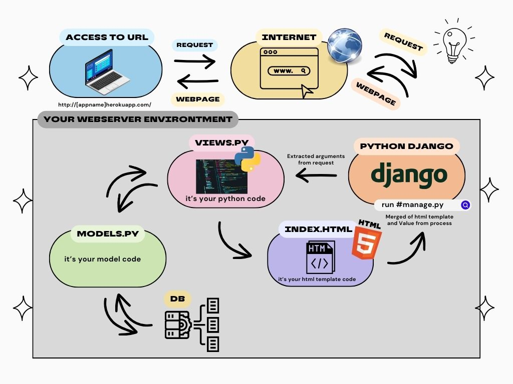
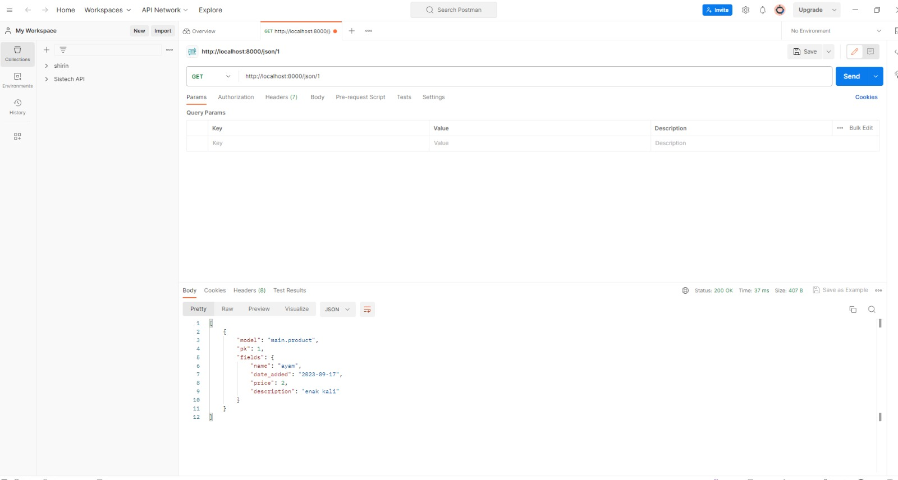
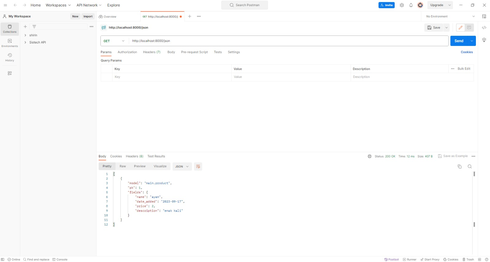
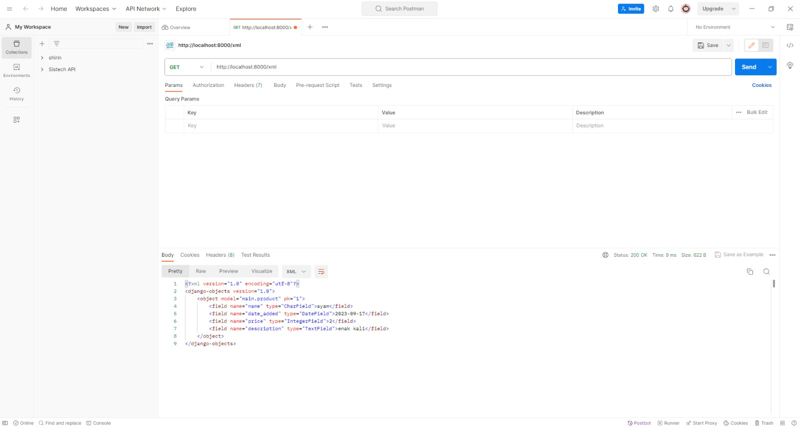
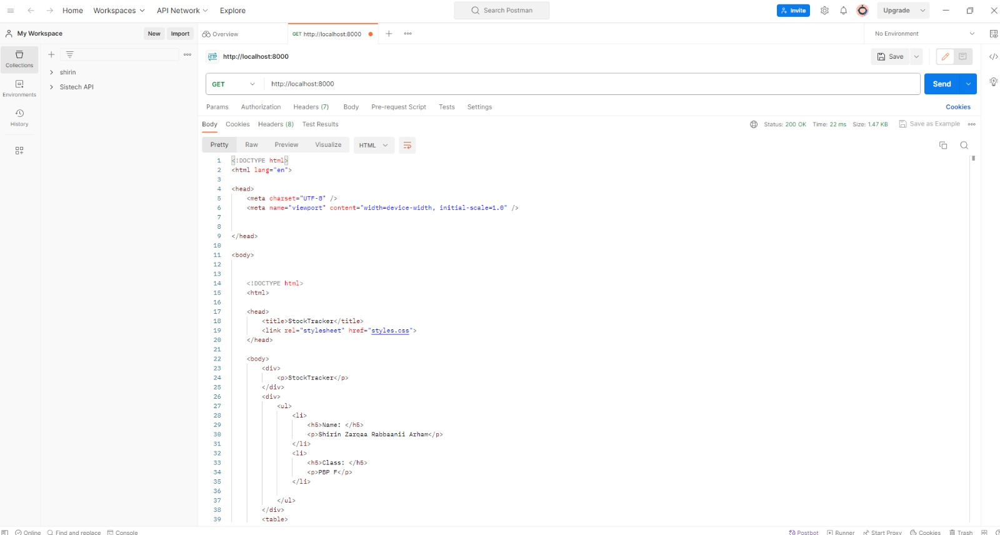

**Link website**: https://stocktracker.adaptable.app/

 TUGAS 2

# 1. Jelaskan bagaimana cara kamu mengimplementasikan checklist di atas secara step-by-step (bukan hanya sekadar mengikuti tutorial).
- membuat direktori baru dapat menggunakan command prompt dengan mkdir / membuat folder langsung di laptop
- pada saat sudah cd ke directory StockTracker buat virtual environtment dengan menjalankan di command prompt
   python -m venv env
   env\Scripts\activate.bat
- menyiapkan dependencies , dengan membuat berkas requirements.txt dan menambahkan beberapa dependencies
- selanjutnya menjalankan virtual enviroment dengan mengawali perintah
   pip install -r requirements.txt
- buat proyek django dengan perintah 
   django-admin startproject StockTracker .
- menambahkan * di settings.py 
   ALLOWED_HOSTS = ["*"]
   menjalankan python manage.py runserver
- membuat repository github dengan nama Stock-Tracker dan menambahkan berkas .gitignore
- melakukan add , commit dan push 
- membuat deployment repository Stock-Tracker di Adaptable.io
- membuat aplikasi main dalam proyek Stock-Tracker , dengan menggunakan perintah 
   python manage.py startapp main
- merevisi code berikut di file settings.py
   INSTALLED_APPS = [
   ...,
   'main',
   ...
   ]
- Mengisi berkas HTML sesuai view yang diinginkan di butuhkan dengan membuat direktori baru bernama templates 
   dan mengisi file main.html
- mengubah berkas model sesuai di soal
- menjalankan perintah python manage.py makemigrations lalu python manage.py migrate
- mengintegrasikan komponen pada mvp dan memodifikasi templates
- mengonfigurasikan routing url dengan membuat berkas urls.py pada direktori main dan mengisi kode urls.py
- menambahkan unit test dengan mengisi berkas tests.py 
- mengisi readme sesuai dengan pertanyaan soal di vscode
- melakukan git add . , commit dan push

   

# 2. Buatlah bagan yang berisi request client ke web aplikasi berbasis Django beserta responnya dan jelaskan pada bagan tersebut kaitan antara urls.py, views.py, models.py, dan berkas html.
   

# 3. Jelaskan mengapa kita menggunakan virtual environment? Apakah kita tetap dapat membuat aplikasi web berbasis Django tanpa menggunakan virtual environment?

- **alasan mengapa menggunakan virtual environtment**
penggunaan virtual environtment bertujuan untuk mengisolasi dan mengelola dependensi pada proyek serta untuk menghindari konflik antara paket Python yang berbeda dalam proyek yang berbeda berikut beberapa alasannya yang lebih spesifik :
   - Isolasi Depedensi : hal ini bertujuan agar berbagai proyek memiliki kemungkinan untuk menggunakan versi paket 
     yang berbeda dan tidak diinginkan adanya konflik diantara mereka.
   - Kebersihan : dapat dengan mudah menghapus atau mengganti dependensi proyek tanpa mempengaruhi sistem python 
     secara general.
   - Kemudahan mengelolo proyek : hal ini karena dapan dengan mudah untuk membuat mengaktifkan, dan menonaktifkan 
     lingkungan virtual, sehingga proyek tetap teratur dan bersih.

- **membuat aplikasi tanpa django virtual environtment**
   - pembuatan aplikasi tanpa menggunakan vitual environtment dapat dilakukan namun bukan praktik yang disarankan karena ada negatif sidenya.Berikut adalah negatif sidenya yaitu keterbatasan izin, penggunaan lingkungan global, pengembangan yang masih sederhana

# 4. Jelaskan apakah itu MVC, MVT, MVVM dan perbedaan dari ketiganya.
   
## MVC ( Model-View-Controller)
### Pengertian 
   suatu model yang seringkali digunakan oleh para pengembang software
### Komponen
- **Model**
berisi logika bisnis dan status data yang ada di dalam aplikasi.komponen ini bertugas untuk mendapatkan dan memanipulasi data, berkomunikasi dengan kontroller, berinteraksi dengan database, terkadang memperbarui tampilan dari aplikasi yang dikembangkan.
- **View**
komponen ini berhubungan dengan antarmuka pengguna yang terdiri dari HTML/CSS.XML. Komponen ini berkomunikasi dengan pengontrol dan terkadang berinteraksi dengan model.Viw berkerja sama dengan controller untuk menciptakan tampilan dinamis pada aplikasi yang dikembangkan.Tugas lain dari komponen ini untuk menyajikan data yang sesuai untuk pengguna.
- **Controller**
suatu aktivitas/fragmen yang berfungsi sebagai komunikator antara view dan model. Komponen ini membutuhkan suatu input pengguna dari layanan view/REST.Setelah itu, Permintaan "Get Data" diproses dari model dan diteruskan ke view untuk ditampilkan ke pengguna.
- **Perbedaan**
Dalam MVC, Controller berperan sebagai perantara antara Model dan View. View dan Model tidak mengetahui satu sama lain. Ini adalah pola desain yang paling umum dalam pengembangan web tradisional.

## MVT (Model-View-Template)
### Pengertian
memiliki kemiripan dengan Model-View-Controller (MVC), MVT memiliki beberapa perbedaan konseptual.
### Komponen
- **Model**
memiliki kemiripan dengan model dalam pola Model-View- Controller, bertanggungjawab untuk mengelola data aplikasi, termasuk struktur basis data, validasi data, dan operasi yang berkaitan dengan data.
- **View**
mirip dengan View dalam MVC, bertnggung jawab untuk menampilkan data kepada pengguna.
- **Template**
mengatur bagaimana data dari model disajikan dalam View.
- **Perbedaan**
MVT adalah pola desain yang lebih umum digunakan dalam kerangka kerja Django untuk pengembangan web    dengan bahasa pemrograman Python.Perbedaan utama adalah penggunaan Template sebagai pengganti Controller.

## MVVM (Model-View-ViewModel)
### Pengertian 
merupakan gabungan dari MVC dan MVP. MVVM awalnya digunakan di dalam windows Presentation Foundation  (WPF) dan Silverlight, yang secara resmi diumumkan pada tahun 2005 oleh John Grossman dalam sebuah posting blog tentang Avalon. Pola yang digunakan berdasarkan gabungan dari MVC dan MVP mencoba untuk lebih jelas dalam memisahkan pengembangan UI dari logika bisnis dan perilaku dalam aplikasi.
### Komponen 
- **Model**
Model yang digunakan mirip dengan model pada MVC, dimana model tersebut terdiri dari data dasar yang digunakan untuk menjalankan perangkat lunak.
- **View**
View digunakan sebagai antarmuka grafis antara pengguna dan pola desain, serta menampilkan output dari data yang telah diproses. View yang digunakan MVVM mirip dengan View yang digunakan dalam MVC.
- **ViewModel**
suatu abtraksi dari View, lalu di sisi yang lain, sebagai penyedia pembungkus data model untuk ditautkan. ViewModel terdiri dari Model yang diubah menjadi View, dan berisi perintah yang dapat digunakan oleh View untuk mempengaruhi Model.
- **Perbedaan** 
MVVM memisahkan tugas Controller dalam MVX dengan menggunakan ViewModel. Hal ini lebih umum digunakan dalam pengembangan aplikasi berbasis antarmuka pengguna (UI), seperti aplikasi mobile atau desktop, dan membantu memisahkan logika bisnis dari tampilan degan lebih baik.

### Kesimpulan
Perbedaan utama antara ketiganya adalah bagaimana masing masing model mengatur aliran data dan tindakan dalam aplikasi.

 

 TUGAS 3 

# 1. Apa perbedaan antara form POST dan form GET dalam Django?
## Metode Pengiriman Data
- **Form POST**
Data dikirim sebagai bagian dari tubuh permintaan HTTP. Data ini tidak terlihat dalam URL dan biasanya digunakan untuk mengirim data sensitif seperti kata sandi atau data yang panjang.
- **Form GET**
Data dikirimkan sebagai parameter yang terlihat dalam URL.Ini biasanya digunakan untuk mengambil data dari server dengan cara yang bersifat idempoten.
## Tampilan data pada URL
- **Form POST**
Data tidak terlihat pada URL sehingga lebih aman dan tidak terbaca oleh pengguna yang melihat histori peramban atau log server.
- **Form GET**
Data terlihat pada URL dan dapat terlihat oleh siapa saja yang melihat URL.
## Jumlah data yang bisa dikirim
- **Form POST**
Dapat mengirimkan jumlah data yang lebih besar deng form POST karena data dikirim sebagai bagian dari tubuh permintaan HTTP.
- **Form GET**
Terdapat batasan pada jumlah data yang dapat dikirimkan dengn form GET karena data harus ditambahkan ke dalam URL. 
## Keamanan
- **Form POST**
Lebih aman untuk mengirim data sensitif karena data tidak terlihat pada URL dan tidak terjadi pencurian data melalui URL
- **Form GET**
Lebih tidak aman untuk data sensitif karena data terlihat pada URL dan dapat dengan mudah diakses oleh pihak ketiga

# 2. Apa perbedaan utama antara XML, JSON, dan HTML dalam konteks pengiriman data?
## Struktur dan Notasi
- **XML**
memiliki sintaks yang lebih kaku dan kompleks dibandingkan JSON dan HTML. XML biasanya digunakan untuk pertukaran data yang terstruktur dengan tipe data yang didefinisikan sendiri.
- **JSON**
memiliki format yang lebih ringan dan mudah dibaca dengan menggunakan pasangan nama/kunci dan nilai.
- **HTML**
Bahasa markup khusus untuk membuat dokumen web dan digunakan untuk merancang tampilan serta struktur web, bukan untuk pertukaran data mentah
## Tujuan Utama
- **XML**
Digunakan untuk pertukaran data terstruktur yang kompleks antara sistem yang berbeda.
- **JSON**
Digunakan untuk pertukaran data ringan, terutama dalam konteks pengembangan web dan API.
- **HTML**
Digunakan untuk membuat tampilan halaman web dan mengatur tampilan konten.
## Flexibility
- **XML**
Lebih fleksibel dalam hal mendefinisikan struktur data yang kustom. Anda dapat membuat skema XML sesuai dengan kebutuhan Anda.
- **JSON**
Lebih sederhana dalam hal struktur dan lebih cocok untuk data yang berurutan atau hirarkis, seperti daftar atau objek bersarang.
- **HTML**
Lebih terbatas pada tampilan halaman web, dengan struktur yang telah ditentukan seperti elemen 
, 
, atau <table>.
## Mendukung tipe data
- **XML**
Dukungan yang lebih baik untuk tipe data yang kompleks melalui skema XML.
- **JSON**
Mendukung tipe data yang sederhana seperti string, angka, boolean, array dan objek.
- **HTML**
Tidak dirancang untuk menyimpan data dalam tipe data yang berarti karena digunakan untuk merancang tampilan web.

# 3. Mengapa JSON sering digunakan dalam pertukaran data antara aplikasi web modern?
- Memiliki format yang ringan dan mudah dibaca oleh manusia dengan cara menggabungkan pasangan nama/kunci dan nilai yang sederhana dalam struktur yang intuitif.
- sangat mudah di integrasikan denga kode JavaScript.
- Dapat dengan mudha mengonversi data JSON kedalam objek atau struktur data yang sesuai degan bahasa pemrograman yang digunakan server atau klien.
- memiliki format terbuka dan tidak memiliki ketergantungan pada platform tertentu.
- mendukung tipe data yang umum digunakan.
- JSON dapat digunakan untuk mengirim berbagai jenis konten
- Dapat digunakan untuk mengirim data dari server ke klien begitupun sebaliknya.
- memiliki format yang cocok untuk digunakan dalam API REST.
# 4. Jelaskan bagaimana cara kamu mengimplementasikan checklist di atas secara step-by-step (bukan hanya sekadar mengikuti tutorial).
- Menjalankan virtual environtment
- mengubah path pada StockTracker di file urls.py menjadi 
urlpatterns = [
path('', include('main.urls')),
path('admin/', admin.site.urls),
]
- membuat folder templates dan membuat file base.html dan di isi
- mengubah 'DIRS': [BASE_DIR / 'templates'], pada subdirektori stocktracker di setting.py
- membuat berkas baru degan nama forms.py dan menyesuaikan strukturnya
- pada berkas views.py di folder main import 
from django.http import HttpResponseRedirect
from main.forms import ProductForm
from django.urls import reverse

dan menambah fungsi create_product yang menerima parameter request
- mengubah fungsi show_main pada berkas views.py dengan menambahkan products = Product.objects.all() dan 'products': products di dalam context pada fungsi 
- menambahkan import fungsi create product pada urls.py di folder main
- menambahkan path url ke urlpatterns pada urls.py di main
- buat berkas baru create_product.html pada direktori main/templates dan mengisi kode sesuai dengan keinginan soal
- menambahkan kode  pada main.html
- mengembalikan data dalam bentuk xml dengan mengimport httpResponse dan Serialize pada views.py dan membuat fungsi sho_xml dengan parameter request dan menambahkan return function
- mengimport fungsi yang sudah di buat pada urls.py di folder main dan menambahkan path url kedalam urlpatterns
- mengembalikan data dalam bentuk json dengn membuat fungsi show_json yang menerima parameter request en menyimpan variabel di data , setelah otu tambahkan return function berupa httpResponse dan mengimport show_json pada urls.py di folder main , setelah itu path juga ditambahkan
- mengembalikan data berdasarkan id dalam bentuk XML dan JSON dengan cara membuat fungsi show_xml_by_id dan show_json_by_id pafa views.py di folder main , setelah itu membuat variabel fungsi dengan menyimpan hasil query dengan id tertentu. setelah itu menambahkan return function berupa HttpResponse yang berisi padara data hasil query yang sudah diserialisasi dan parameter content_type dengan value "application/xml" (untuk format XML) atau "application/json" (untuk format JSON).
- mengimport fungsi yang tadi di buat di file urls.py pada folder main dan menambahkan path url ke dalam urlpatterns.
- melakukan deployment
# 5. Mengakses kelima URL di poin 2 menggunakan Postman, membuat screenshot dari hasil akses URL pada Postman, dan menambahkannya ke dalam README.md.

  

