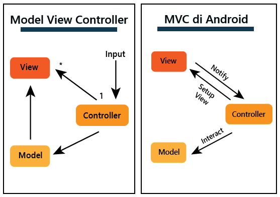
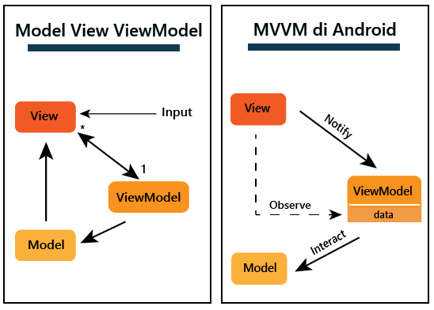

 
1. Jelaskan bagaimana cara kamu mengimplementasikan checklist di atas secara step-by-step (bukan hanya sekadar mengikuti tutorial).
   -> membuat direktori baru dapat menggunakan command prompt dengan mkdir / membuat folder langsung di laptop
   -> pada saat sudah cd ke directory StockTracker buat virtual environtment dengan menjalankan di command prompt
      python -m venv env
      env\Scripts\activate.bat
   -> menyiapkan dependencies , dengan membuat berkas requirements.txt dan menambahkan beberapa dependencies
   -> selanjutnya menjalankan virtual enviroment dengan mengawali perintah
      pip install -r requirements.txt
   -> buat proyek django dengan perintah 
      django-admin startproject StockTracker .
   -> menambahkan * di settings.py 
      ALLOWED_HOSTS = ["*"]
      menjalankan python manage.py runserver
   -> membuat repository github dengan nama Stock-Tracker dan menambahkan berkas .gitignore
   -> melakukan add , commit dan push 
   -> membuat deployment repository Stock-Tracker di Adaptable.io
   -> membuat aplikasi main dalam proyek Stock-Tracker , dengan menggunakan perintah 
      python manage.py startapp main
   -> merevisi code berikut di file settings.py
      INSTALLED_APPS = [
      ...,
      'main',
       ...
      ]
   -> Mengisi berkas HTML sesuai view yang diinginkan di butuhkan dengan membuat direktori baru bernama templates 
      dan mengisi file main.html
   -> mengubah berkas model sesuai di soal
   -> menjalankan perintah python manage.py makemigrations lalu python manage.py migrate
   -> mengintegrasikan komponen pada mvp dan memodifikasi templates
   -> mengonfigurasikan routing url dengan membuat berkas urls.py pada direktori main dan mengisi kode urls.py
   -> menambahkan unit test dengan mengisi berkas tests.py 
   -> mengisi readme sesuai dengan pertanyaan soal di vscode
   -> melakukan git add . , commit dan push

   

   
2. Buatlah bagan yang berisi request client ke web aplikasi berbasis Django beserta responnya dan jelaskan pada bagan tersebut kaitan antara urls.py, views.py, models.py, dan berkas html.
   
   

3. Jelaskan mengapa kita menggunakan virtual environment? Apakah kita tetap dapat membuat aplikasi web berbasis Django tanpa menggunakan virtual environment?

-> alasan mengapa menggunakan virtual environtment
   penggunaan virtual environtment bertujuan untuk mengisolasi dan mengelola dependensi pada proyek serta untuk    
   menghindari konflik antara paket Python yang berbeda dalam proyek yang berbeda berikut beberapa alasannya yang 
   lebih spesifik :
   - Isolasi Depedensi : hal ini bertujuan agar berbagai proyek memiliki kemungkinan untuk menggunakan versi paket 
     yang berbeda dan tidak diinginkan adanya konflik diantara mereka.
   - Kebersihan : dapat dengan mudah menghapus atau mengganti dependensi proyek tanpa mempengaruhi sistem python 
     secara general.
   - Kemudahan mengelolo proyek : hal ini karena dapan dengan mudah untuk membuat mengaktifkan, dan menonaktifkan 
     lingkungan virtual, sehingga proyek tetap teratur dan bersih.

-> membuat aplikasi tanpa django virtual environtment
   - pembuatan aplikasi tanpa menggunakan vitual environtment dapat dilakukan namun bukan praktik yang disarankan 
     karena ada negatif sidenya.Berikut adalah negatif sidenya yaitu keterbatasan izin, penggunaan lingkungan 
     global, pengembangan yang masih sederhana

4. Jelaskan apakah itu MVC, MVT, MVVM dan perbedaan dari ketiganya.
   
-> MVC ( Model-View-Controller)
   - Pengertian 
    suatu model yang seringkali digunakan oleh para pengembang      
    software
   - Komponen
     -> Model
        berisi logika bisnis dan status data yang ada di dalam aplikasi.komponen ini bertugas untuk 
        mendapatkan dan memanipulasi data, berkomunikasi dengan kontroller, berinteraksi dengan database, 
        terkadang memperbarui tampilan dari aplikasi yang dikembangkan.
     -> View
        komponen ini berhubungan dengan antarmuka pengguna yang terdiri dari HTML/CSS.XML. Komponen ini 
        berkomunikasi dengan pengontrol dan terkadang berinteraksi dengan 
        model.Viw berkerja sama dengan controller untuk menciptakan tampilan dinamis pada aplikasi yang  
        dikembangkan.Tugas lain dari komponen ini untuk menyajikan data yang sesuai untuk pengguna.
     ->  Controller
        suatu aktivitas/fragmen yang berfungsi sebagai komunikator antara view dan model. Kompoen ini 
        membutuhkan suatu input pengguna dari layanan view/REST.Setelah itu, Permintaan "Get Data" diproses 
        dari model dan diteruskan ke view untuk ditampilkan ke pengguna.
     -> Perbedaan
        Dalan MVC, Controller berperan sebagai perantara antara Model dan View. View dan Model tidak 
        mengetahui satu sama lain. Ini adalah pola desain yang paling umum dalam pengembangan web tradisional.
        
        

-> MVT (Model-View-Template)
    - Pengertian
      memiliki kemiripan dengan Model-View-Controller (MVC), MVT memiliki beberapa perbedaan konseptual.
    - Komponen
     -> Model
        memiliki kemiripan dengan model dalam pola Model-View- Controller, bertanggungjawab untuk mengelola 
        data aplikasi, termasuk struktur basis data, validasi data, dan operasi yang berkaitan dengan data.
     -> View
        mirip dengan View dalam MVC, bertnggung jawab untuk menampilkan data kepada pengguna.
     -> Template
        mengatur bagaimana data dari model disajikan dalam View.
     -> Perbedaan 
        MVT adalah pola desain yang lebih umum digunakan dalam kerangka kerja Django untuk pengembangan web    
        dengan bahasa pemrograman Python.Perbedaan utama adalah penggunaan Template sebagai pengganti 
        Controller.

-> MVVM (Model-View-ViewModel)
    - Pengertian 
      merupakan gabungan dari MVC dan MVP. MVVM awalnya digunakan di dalam windows Presentation Foundation  
      (WPF) dan Silverlight, yang secara resmi diumumkan pada tahun 2005 oleh John Grossman dalam sebuah 
      posting blog tentang Avalon. Pola yang digunakan berdasarkan gabungan dari MVC dan MVP mencoba untuk 
      lebih jelas dalam memisahkan pengembangan UI dari logika bisnis dan perilaku dalam aplikasi.
    - Komponen 
     -> Model
        Model yang digunakan mirip dengan model pada MVC, dimana model tersebut terdiri dari data dasar yang 
        digunakan untuk menjalankan perangkat lunak.
     -> View
        View digunakan sebagai antarmuka grafis antara pengguna dan pola desain, serta menampilkan output dari 
        data yang telah diproses. View yang digunakan MVVM mirip dengan View yang digunakan dalam MVC.
     -> ViewModel
        suatu abtraksi dari View, lalu di sisi yang lain, sebagai penyedia pembungkus data model untuk 
        ditautkan. ViewModel terdiri dari Model yang diubah menjadi View, dan berisi perintah yang dapat 
        digunakan oleh View untuk mempengaruhi Model.
     -> Perbedaan 
        MVVM memisahkan tugas Controller dalam MVX dengan menggunakan ViewModel. Hal ini lebih umum digunakan 
        dalam pengembangan aplikasi berbasis antarmuka pengguna (UI), seperti aplikasi mobile atau desktop, 
        dan membantu memisahkan logika bisnis dari tampilan degan lebih baik.

        

        

-> Kesimpulan
   Perbedaan utama antara ketiganya adalah bagaimana masing masing model mengatur aliran data dan tindakan  
   dalam aplikasi. 
     

